# MotoVerse — Multi-brand Motorcycle Group

> **Assessment notice:** MotoVerse Group and its brands (Volta, Nomad, Apex, Sovereign), products, prices,
> showrooms and offers are **fictional** and were created solely for the Almana Group Full-Stack Developer
> recruitment assessment. This is an original concept (Option 1), not a redesign of an existing website,
> and it is not intended for commercial use. All third-party trademarks visible in stock photography remain
> the property of their respective owners.

A dark-themed digital presence for a motorcycle group operating across the GCC, plus a small CMS where staff
manage brand content under role-based, brand-scoped access control.

**Repository:** https://github.com/mohamed-hamdy1997/motoverse

---

## 1. The concept

MotoVerse represents four brands, one per market segment, each with its own accent colour and voice:

| Brand | Segment | Accent | Personality |
|---|---|---|---|
| **Volta** | Urban Mobility | Teal `#2dd4bf` | Electric-first, city-smart |
| **Nomad** | Adventure & Touring | Olive `#a8b545` | Desert-ready, long-range |
| **Apex** | Performance | Crimson `#f43f5e` | Race-bred |
| **Sovereign** | Premium | Champagne `#d6b56d` | Hand-finished craft |

The group identity is a near-black "ink" palette with a "signal orange" accent; each brand's accent colour
takes over inside its own UI (brand panels, model cards, offers), so brands keep their identity while
remaining clearly part of one house.

### Homepage journey

1. **Hero** — group promise, primary CTA (test ride), quick links into each brand.
2. **Our brands** — expanding brand panels (accordion on desktop, stacked on mobile).
3. **Line-up** — all models with specs and prices, filterable by brand and "electric only".
4. **Offers** — live promotions, with a countdown to each end date.
5. **Services** — sales, test rides, financing, service, parts, warranty, customer care, rider academy.
6. **Finance estimator** — pick a model, down payment and term to see a monthly instalment.
7. **Showrooms** — locations grouped by country with hours, phone and directions.
8. **Test ride & enquiry form** — validated, stored in the database and routed to the right brand team.

Sections hand off to each other: "Test ride" on a model card pre-fills the enquiry form, "Calculate monthly"
pre-selects the model in the estimator, and "Explore line-up" filters the line-up by that brand.

---

## 2. Tech stack

| Layer | Choice | Why |
|---|---|---|
| Backend | **Laravel 13** (PHP 8.3) | Required stack. |
| Frontend bridge | **Inertia.js v3** | SPA experience with server-side routing, validation and auth. No separate API needed. |
| UI | **Vue 3** (`<script setup>`) | Component model for the interactive homepage and CMS. |
| Components | **PrimeVue 4.5** (Aura preset, customised) | Accessible inputs, selects, date picker, data table, dialogs and toasts. |
| Styling | **Tailwind CSS v4** + `tailwindcss-primeui` | Design tokens in `resources/css/app.css` shared with the PrimeVue preset (`resources/js/theme.js`). |
| Routing in JS | **Ziggy** | Named Laravel routes in Vue (`route('admin.motorcycles.edit', id)`). |
| Database | **MySQL 8** | |
| Tests | **PHPUnit** feature tests | Auth, authorization, validation, public content rules. |

---

## 3. Getting started

### Requirements

PHP 8.3+ with `pdo_mysql`, Composer 2, Node 20+, MySQL 8.

### Setup

```bash
git clone https://github.com/mohamed-hamdy1997/motoverse.git && cd motoverse

composer install
npm install

cp .env.example .env
php artisan key:generate
# Set DB_DATABASE / DB_USERNAME / DB_PASSWORD in .env, then create the database:
mysql -u root -p -e "CREATE DATABASE motoverse"

php artisan migrate --seed      # schema + demo brands, models, offers, showrooms, users, enquiries
php artisan storage:link        # serves CMS image uploads

npm run build                   # or `npm run dev` while developing
php artisan serve               # http://localhost:8000
```

`composer run dev` starts the PHP server, queue listener, log tail and Vite together.

### Admin / CMS test credentials

Sign in at **`/admin/login`** (also linked as "Staff login" in the footer). The login page lists these
accounts and fills them in with one click. Password for all: **`password`**

| Email | Role | Can manage |
|---|---|---|
| `admin@motoverse.test` | Admin | Every brand, plus users |
| `editor@motoverse.test` | Data Entry | Volta and Nomad only |
| `apex@motoverse.test` | Data Entry | Apex only |

### Running the tests

The tests use a separate MySQL database (configured in `phpunit.xml`):

```bash
mysql -u root -p -e "CREATE DATABASE motoverse_test"
php artisan test
```

---

## 4. Administration / CMS

| Module | Admin | Data Entry |
|---|---|---|
| Dashboard | Group-wide stats | Stats for assigned brands only |
| Brands | Create, edit, delete | Edit the profile of assigned brands only |
| Motorcycles | Full CRUD (with image upload) | CRUD within assigned brands |
| Promotions | Full CRUD | CRUD within assigned brands |
| Enquiries | View, change status, delete | View and change status for assigned brands |
| Users | Create, edit and delete; assign brands | No access |

### How access control works

Access is checked at three layers:

1. **Authentication**: session login with a rate limit of 5 failed attempts per email and IP
   (`LoginRequest`), plus session regeneration on login and logout.
2. **Authorization (policies)**: `app/Policies/*Policy.php` decide whether a user can act on a record.
   The Form Requests call the policy in `authorize()`, so an unauthorized request gets a **403 before
   validation runs**. The controllers use `Gate::authorize()` for `create`, `edit` and `destroy`.
3. **Query scoping**: the `BelongsToBrand` trait adds a `manageableBy($user)` scope. Listings and stats only
   ever query records the user may manage, so data never leaks into the UI.

In addition, `brand_id` is validated against `$user->managedBrandIds()`. A data-entry user therefore cannot
create a model in another brand or move one there, even with a crafted request.

### Other security measures

- Mass assignment is limited with `#[Fillable]` and validated data only (`$request->validated()` / `safe()`).
- Uploads must be images (jpg/png/webp, at most 4 MB). They are stored on the `public` disk under generated
  names, and the old file is deleted when it is replaced.
- The public enquiry endpoint is rate-limited to 5 requests per minute per IP.
- Vue escapes all output, and the codebase never uses `v-html`. CSRF protection is handled by Laravel and
  Inertia.
- Admins cannot delete their own account.

---

## 5. Project structure

```
app/
├── Enums/                 UserRole, BrandSegment, MotorcycleCategory, EnquiryType, EnquiryStatus
│   └── Concerns/HasOptions.php      enum → select options for the frontend
├── Http/
│   ├── Controllers/       thin controllers (HomeController, EnquiryController)
│   │   ├── Admin/         Dashboard, Brand, Motorcycle, Promotion, Enquiry, User
│   │   └── Auth/          LoginController
│   ├── Middleware/HandleInertiaRequests.php   shared props: auth user, flash messages
│   ├── Requests/          validation + authorization (Admin/*, Auth/LoginRequest, StoreEnquiryRequest)
│   └── Resources/         API resources that shape every Inertia prop
├── Models/                Brand, Motorcycle, Promotion, Showroom, Enquiry, User
│   └── Concerns/          BelongsToBrand (relation + scope), HasImageUrl
├── Policies/              per-model authorization rules
└── Services/              business logic: HomePage, Brand, Motorcycle, Promotion, Enquiry,
                           User, Dashboard, ImageUpload, Slug

resources/js/
├── app.js, theme.js       Inertia bootstrap, PrimeVue preset
├── Layout/                PublicLayout, AdminLayout, GuestLayout
├── Pages/                 Home, Auth/Login, Error, Admin/{Dashboard,Brands,Motorcycles,Promotions,Enquiries,Users}
├── Components/
│   ├── Home/              one component per homepage section + ModelCard, SectionHeading
│   ├── Form/              El* field components bound to Inertia forms (form + name props)
│   ├── Table/ElDataTable  PrimeVue DataTable wrapper for Laravel (paginated) resources
│   ├── Admin/             nav, filter bar, row actions, status badge, form actions
│   └── Brand/, Text/, Buttons/, Main/
├── Composables/           useFieldShell/useFieldError, useResourceForm, useDeleteConfirm,
│                          useFlashToast, useHomeIntent (cross-section homepage state)
├── directive/RevealDirective.js     scroll-reveal animation (respects reduced motion)
└── Helpers/format.js      currency, countdown and instalment maths
```

**Request flow:** route → Form Request (authorize + validate) → thin controller → service → Eloquent →
API Resource → Inertia page.

The `El*` form components follow the convention of a previous production Vue/PrimeVue codebase: each field
takes `form` and `name` and renders a floating label, a required marker and the server-side error. Their shared
logic lives in the `useFieldShell` composable instead of being repeated in every component.

---

## 6. Database design (ERD)

```mermaid
erDiagram
    USERS ||--o{ BRAND_USER : "assigned to"
    BRANDS ||--o{ BRAND_USER : "has editors"
    BRANDS ||--o{ MOTORCYCLES : "offers"
    BRANDS ||--o{ PROMOTIONS : "runs"
    BRANDS |o--o{ ENQUIRIES : "receives"
    MOTORCYCLES |o--o{ ENQUIRIES : "about"
    SHOWROOMS |o--o{ ENQUIRIES : "at"

    USERS {
        bigint id PK
        string name
        string email UK
        string password
        string role "admin | data_entry"
    }
    BRANDS {
        bigint id PK
        string name
        string slug UK
        string segment "urban_mobility | adventure_touring | performance | premium"
        string tagline
        text description
        string accent_color "#rrggbb"
        string cover_image "nullable"
        boolean is_active
        smallint sort_order
    }
    BRAND_USER {
        bigint brand_id PK, FK
        bigint user_id PK, FK
    }
    MOTORCYCLES {
        bigint id PK
        bigint brand_id FK
        string name
        string slug UK
        string category "scooter | naked | adventure | sport | cruiser | classic"
        decimal price
        smallint engine_cc "null = electric"
        smallint power_hp
        smallint weight_kg
        string image "nullable"
        text description
        boolean is_featured
        boolean is_published
    }
    PROMOTIONS {
        bigint id PK
        bigint brand_id FK
        string title
        string highlight
        text description
        date starts_at
        date ends_at
        boolean is_active
    }
    SHOWROOMS {
        bigint id PK
        string name
        string city
        string country
        string address
        string phone
        string opening_hours
        boolean has_service_center
    }
    ENQUIRIES {
        bigint id PK
        string type "test_ride | sales | finance | service"
        string status "new | contacted | closed"
        bigint brand_id FK "nullable"
        bigint motorcycle_id FK "nullable"
        bigint showroom_id FK "nullable"
        string name
        string email
        string phone
        date preferred_date
        text message
    }
```



Design notes:

- **`brand_user` pivot**: a data-entry user can be assigned to several brands, and a brand can have several
  editors. Admins need no rows here because they implicitly manage every brand.
- **Enquiries store `brand_id`**, which is derived from the chosen model when the enquiry is submitted. This
  keeps brand scoping a simple indexed `WHERE brand_id IN (...)`. Enquiries without a brand are general
  questions that only admins see.
- Enums are stored as strings and cast to PHP backed enums, which keeps them readable in the database and
  type-safe in code.
- Foreign keys cascade from brand to its content. Enquiries use `nullOnDelete`, so customer history survives
  the deletion of a model, brand or showroom.
- Composite indexes support the hot public queries: `(is_published, is_featured)` and
  `(is_active, starts_at, ends_at)`.

---

## 7. Assumptions

- **Original fictional concept** (assessment Option 1). Prices are in **QAR** and the group is headquartered
  in Doha, with locations in the UAE, Saudi Arabia and Kuwait.
- One homepage is the public deliverable, as allowed by the brief. Detailed model and brand pages, and
  online checkout, are out of scope. The "Explore line-up" buttons filter the homepage instead.
- **Showrooms are seeded reference data** and are not editable in the CMS. They are group-level, not
  brand-level, so the two-role brand model did not require it.
- Promotions appear publicly only when active **and** today falls inside their date window. The seed data
  includes an expired promotion to show this.
- The finance estimator uses an indicative flat 3.99% annual rate and is for illustration only.
- Phone numbers, emails and social links are placeholders.
- The UI is English-only and left-to-right. Arabic/RTL support would be the next step for a regional launch.
- Data-entry users can edit their brand's profile (tagline, description, accent and cover). Creating or
  deleting brands is limited to admins.

---

## 8. Attribution & references

### Photography — [Unsplash](https://unsplash.com) (Unsplash License, free to use)

All photos are stock images downloaded from Unsplash and stored in `public/images`. Some show real
manufacturers' products and logos. These are used purely as placeholder imagery for the fictional brands and
do not imply any affiliation.

| File | Photographer | Unsplash page |
|---|---|---|
| `hero/hero.jpg` | Harley-Davidson | https://unsplash.com/photos/zGzXsJUBQfs |
| `brands/volta.jpg` | Logan Weaver | https://unsplash.com/photos/8zz3aa0dqHQ |
| `brands/nomad.jpg` | Patrick Hendry | https://unsplash.com/photos/twzniBXSTfA |
| `brands/apex.jpg` | Mike Swigunski | https://unsplash.com/photos/z9lWh_8MLlw |
| `brands/sovereign.jpg` | Harley-Davidson | https://unsplash.com/photos/1HZcJjdtc9g |
| `models/volta-pulse-e.jpg` | Hari Nandakumar | https://unsplash.com/photos/prRb5I_4MAw |
| `models/volta-metro-125.jpg` | Claudio Schwarz | https://unsplash.com/photos/EDY1KzDP0a4 |
| `models/volta-volt-r.jpg` | Harley-Davidson | https://unsplash.com/photos/eeTJKC_wz34 |
| `models/nomad-atlas-1250.jpg` | Ilya Godze | https://unsplash.com/photos/e7IaViDqYII |
| `models/nomad-ridge-800.jpg` | DM David | https://unsplash.com/photos/rJ2KwW59gNA |
| `models/nomad-trail-450.jpg` | Jeremy Bishop | https://unsplash.com/photos/-P-YV9aTyHE |
| `models/apex-rr-1000.jpg` | Kirill Petropavlov | https://unsplash.com/photos/f_gCjlNcVWo |
| `models/apex-strike-600.jpg` | Erkka Wessman | https://unsplash.com/photos/nKhJCl4AgPU |
| `models/apex-fury-890.jpg` | Gijs Coolen | https://unsplash.com/photos/-5rcxih1e44 |
| `models/sovereign-imperial-1900.jpg` | D T | https://unsplash.com/photos/YRGsG4oiNIg |
| `models/sovereign-noir-1800.jpg` | Harley-Davidson | https://unsplash.com/photos/HYjJ1_AZnqw |
| `models/sovereign-heritage-650.jpg` | Lino | https://unsplash.com/photos/C2SzUyg3PPQ |
| `sections/service.jpg` | Angry._.Kat | https://unsplash.com/photos/4ORysIjH-mY |
| `sections/test-ride.jpg` | Cok Wisnu | https://unsplash.com/photos/-IPFb6J03Mw |
| `sections/finance.jpg` | Glen Alejandro | https://unsplash.com/photos/EQ7vori1wJU |

### Fonts, icons & libraries

- **Barlow Condensed** and **Inter** are served by [Google Fonts](https://fonts.google.com) under the SIL Open
  Font License.
- [PrimeIcons](https://primeng.org/icons) (MIT).
- [PrimeVue](https://primevue.org), [Inertia.js](https://inertiajs.com), [Vue](https://vuejs.org),
  [Tailwind CSS](https://tailwindcss.com), [Laravel](https://laravel.com) and
  [Ziggy](https://github.com/tighten/ziggy), all MIT-licensed.
- The MotoVerse logo mark and favicon are original SVGs made for this project.

### AI usage disclosure

- **No AI-generated imagery** is used. All photos come from Unsplash.

---

## 9. Submission checklist

- [x] Source code repository — https://github.com/mohamed-hamdy1997/motoverse
- [x] Setup and run instructions (section 3)
- [x] Admin/CMS test credentials (section 3)
- [x] Technical approach and technology choices (sections 2, 4 and 5)
- [x] Database planning and ERD (section 6)
- [x] Assumptions (section 7)
- [x] Attribution, references and AI disclosure (section 8)
- [ ] Deployed URL — *to be added*
- [ ] Video demo — *to be recorded*
